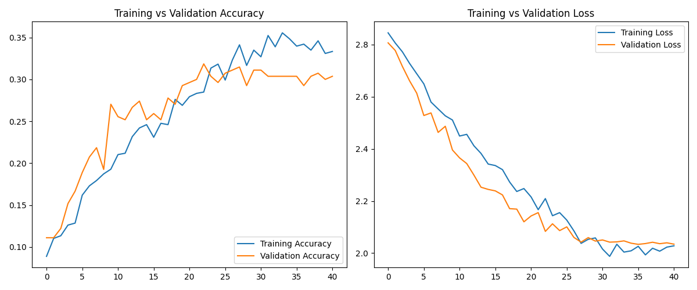
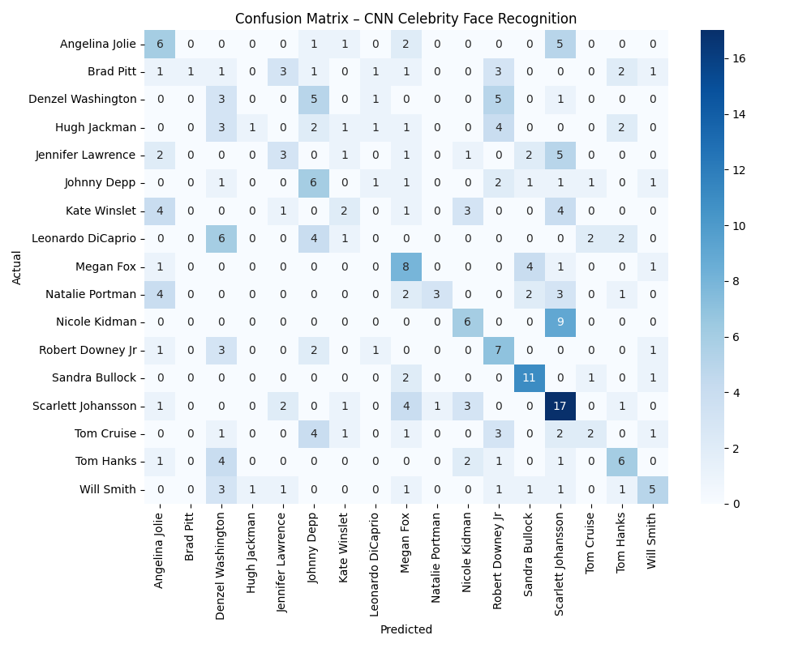

## 🧠 Reconnaissance Faciale de Célébrités avec CNN

Ce projet implémente une solution complète de reconnaissance faciale basée sur un réseau de neurones convolutif (CNN), entraîné sur un dataset de visages de célébrités.

## 📁 Préparation du jeu de données

### `download_celebrity_dataset.py`

Télécharge automatiquement le dataset depuis Kaggle.

- 📦 **Source** : [`vishesh1412/celebrity-face-image-dataset`](https://www.kaggle.com/datasets/vishesh1412/celebrity-face-image-dataset)
- 📁 **Sortie** : Dossier local contenant les images des célébrités

### `split_celebrity_dataset.py`

Divise le dataset téléchargé en trois sous-dossiers :
- train/ : 70%
- val/ : 15%
- test/ : 15%

Structure adaptée à Keras, avec un sous-dossier par classe.

## 🧠 Entraînement et évaluation du modèle

### `train.py`

- 📊 Prétraitement et augmentation des données (rotation, zoom, translation...)
- 🧠 Architecture CNN simple avec 3 blocs Conv2D + MaxPooling
- 🛑 Callbacks : "EarlyStopping" & "ReduceLROnPlateau"
- 📈 Affichage des courbes d’apprentissage
- 💾 Sauvegarde du modèle au format ".keras"

### `evaluate.py`

- 🔍 Évaluation sur les données de test (test/)
- 📋 Rapport de classification (précision, rappel, F1-score)
- 🧾 Matrice de confusion avec heatmap Seaborn

## ⚙️ Installation

```bash
pip install tensorflow matplotlib seaborn scikit-learn kagglehub
```
## 🚀 Exécution

Téléchargement du dataset :
```bash
python download_celebrity_dataset.py
```
Découpage du dataset :
```bash
python split_celebrity_dataset.py
```
Entraînement du modèle :
```bash
python train.py
```
Évaluation des performances :
```bash
python evaluate.py
```
## 📊 Résultats

#### 📈 Courbes d'apprentissage
<p>  </p>

#### 🧾 Matrice de confusion

<p>  </p>

#### 📋 Exemple de rapport de classification
```bash
=== Classification Report ===
               precision    recall  f1-score   support

      Celebrity_A       0.89      0.85      0.87        20
      Celebrity_B       0.91      0.95      0.93        22
      ...
```
## 📌 Auteurs & Crédits

- Dataset par Vishesh1412 sur Kaggle
- Projet développé avec TensorFlow/Keras
